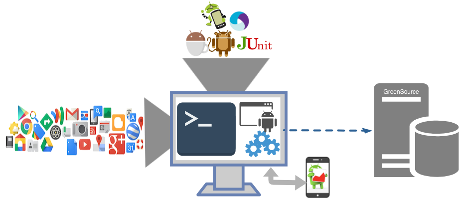

# AnaDroid
[](https://travis-ci.com/RRua/pyAnaDroid)
[](https://www.python.org/)
[](https://badge.fury.io/py/anadroid)
[](https://pypi.python.org/pypi/anadroid)
[](https://pypi.python.org/pypi/anadroid)

Anadroid is a tool capable of automating the process of analyzing and benchmarking Android applications' energy consumption, using state-of-the-art energy analysis tools. Anadroid can be configured to use different energy profilers and test frameworks in its execution pipeline, being able to perform automatic instrumentation and building of application source code. It can be used to perform both white-box and lack-box testing.

## Use cases:
- Application Benchmarking: Replicating test work/procedures on different applications to carry out comparative studies of energy consumption.
- Detection of energy hotspots in application code;
- Detection of energy-greedy coding practices;
- Calibration of energy consumption prediction models;
- Many others.  


## Supported Test Frameworks:
- Any JUnit-based framework (Robotium, Espresso, JUnit);
- Application UI/Exerciser Monkey;
- Monkeyrunner;
- DroidBot;
- App Crawler;
- RERAN;

## Supported energy profilers:
- Trepn Profiler;
- Manafa;
- Monsoon (soon);
- GreenScaler;


# Workflow

By default, Anadroid is configured to perform white-box testing of applications, instrumenting its code (Java and/or Kotlin), in order to collect tracing of the methods invoked during application execution and estimate the energy consumed by these. After the instrumentation phase, a project is created in the original directory, which is a copy of it, with the code and build scripts already instrumented. Then, the source code and apk are built from the sources of the instrumented project (both debug and release builds are supported), and the application is installed on the device. After installation, the energy profiler is enabled and the application tests are executed. At the end of the process, the monitoring process is stopped and its results collected, and the application is uninstalled.



# Installation:

```
$ pip install anadroid
```

# Examples

### Execute a simple Monkey test over an application

By default, Anadroid uses Manafa profiler to estimate energy consumption. The Monkey test (or any other test with other supported testing framework) and its parameters can be configured by modifying the .cfg present in the resources/testingFrameworks/<framework> directory. The results are stored in the results/<app_id>/<app_version> directory

```
from anadroid.Anadroid import AnaDroid

folder_of_app = "demoProjects/SampleApp"
anadroid = AnaDroid(folder_of_app, testing_framework=TESTING_FRAMEWORK.MONKEY)
anadroid.defaultWorkflow()
```

# TODO
- merge test apk with androguard
- results resume file
- test greenscaler on rooted devices
- monsoon


